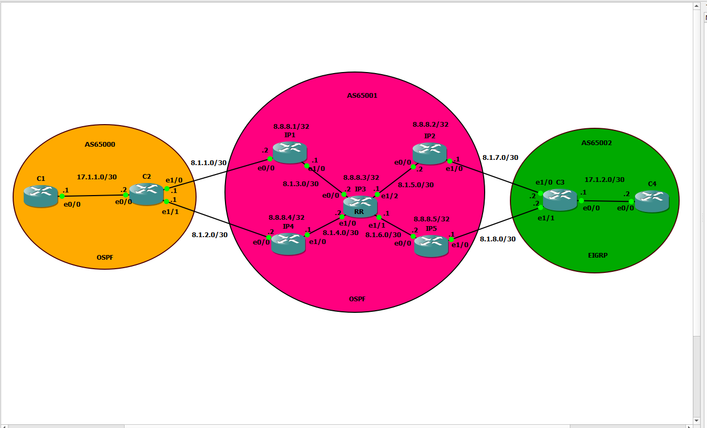

# Inter-AS Routing: BGP, OSPF, EIGRP & Route Reflector

## 🎯 Objective
This lab demonstrates advanced routing integration between three different Autonomous Systems (AS), focusing on BGP scalability and redistribution between IGPs (OSPF and EIGRP).

## 🗺️ Topology


## 🏗️ Architecture
*   **AS 65000 (Left/Orange):** Internal routing using **OSPF**. Focus on eBGP peering at the edge.
*   **AS 65001 (Center/Pink):** Core Service Provider network using **OSPF** as IGP. It implements **iBGP with a Route Reflector (RR)** on Router IP3 to solve the BGP Full Mesh requirement.
*   **AS 65002 (Right/Green):** Internal routing using **EIGRP**.

## 🛠️ Technologies & Features
- **eBGP & iBGP**: Inter-AS connectivity and internal route propagation.
- **BGP Route Reflector**: Configured on IP3 to reflect routes to neighbors (IP1, IP2, IP4, IP5).
- **Route Redistribution**: Mutual redistribution between BGP and IGPs to ensure end-to-end reachability.
- **Loopback Peering**: Best practice for BGP session stability.

## ✅ Verification & Results
- **Control Plane**: `show ip bgp summary` and `show ip bgp` confirm all prefixes are learned.
- **OSPF Adjacencies**: Confirmed in FULL state within the core.
- **Data Plane**: Successful `traceroute` from AS 65000 (C1) to AS 65002 (C4), proving correct path selection across multiple AS.

## 🚀 Key Configurations
Example of Route Reflector configuration on **IP3**:
```cisco
router bgp 65001
 neighbor 8.1.3.2 remote-as 65001
 neighbor 8.1.3.2 route-reflector-client
 neighbor 8.1.4.2 remote-as 65001
 neighbor 8.1.4.2 route-reflector-client